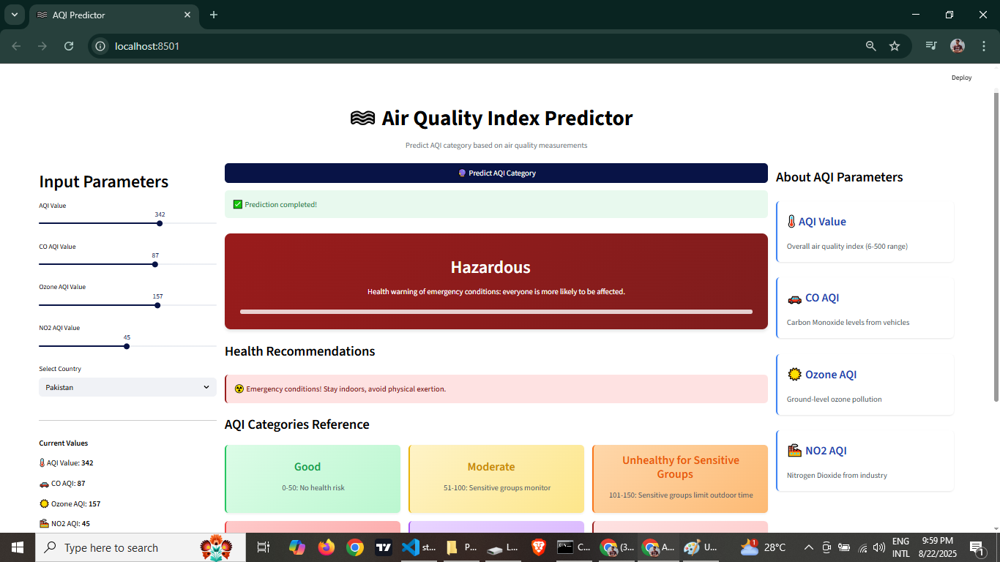
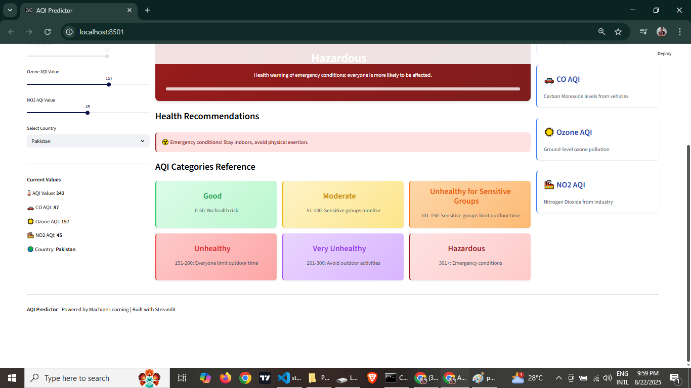

# 🌫️ Air Quality Index (AQI) Predictor

A Machine Learning application that predicts PM2.5 Air Quality Index (AQI) categories based on various air quality parameters. The app provides real-time predictions with health recommendations.

🔗 Try it live: https://air-quality-predictor-007.streamlit.app/

---

## 🎯 Features

- **Real-time AQI Prediction**: Predict PM2.5 AQI categories using multiple air quality parameters
- **Interactive Web Interface**: User-friendly Streamlit interface with responsive design
- **Visual Health Indicators**: Color-coded predictions with category-specific styling
- **Health Recommendations**: Personalized health advice based on predicted AQI levels
- **Country-specific Analysis**: Support for 150+ countries worldwide
- **Comprehensive AQI Reference**: Built-in AQI categories guide

## 🎬 Demo

Here's the screenshots of the app interface:




## 🧠 Model Performance

The project uses a **Decision Tree Classifier** that achieved:
- **Training Accuracy**: 97.52%
- **Test Accuracy**: 97.79%
- **Weighted F1-Score**: 0.98

### Model Comparison
| Model | Training Accuracy | Test Accuracy | F1-Score |
|-------|-------------------|---------------|----------|
| Decision Tree | 97.52% | 97.79% | 0.98 |
| SVC | 94.73% | 93.28% | 0.93 |
| Gaussian NB | 18.98% | 17.68% | 0.22 |

## 📊 AQI Categories

The model predicts six AQI categories:

| Category | AQI Range | Color | Health Impact |
|----------|-----------|-------|---------------|
| Good | 0-50 | 🟢 Green | No health risk |
| Moderate | 51-100 | 🟡 Yellow | Sensitive groups monitor |
| Unhealthy for Sensitive Groups | 101-150 | 🟠 Orange | Sensitive groups limit outdoor time |
| Unhealthy | 151-200 | 🔴 Red | Everyone limit outdoor time |
| Very Unhealthy | 201-300 | 🟣 Purple | Avoid outdoor activities |
| Hazardous | 301+ | 🟤 Maroon | Emergency conditions |

## 🏗️ Project Structure

```
air-quality-predictor/
├── .streamlit/
│   └── config.toml              # Streamlit configuration
├── aqi_model.ipynb              # Jupyter notebook with model training
├── dt_model.joblib              # Trained Decision Tree model
├── streamlit_app.py             # Main Streamlit application
├── requirements.txt             # Python dependencies
├── README.md                    # Project documentation
├── assets/
   └── preview1.png              # Image1
   └── preview2.png              # Image2

```

## 🚀 Quick Start

### 1. Clone the Repository
```bash
git clone https://github.com/adeel-iqbal/air-quality-predictor.git
cd air-quality-predictor
```

### 2. Install Dependencies
```bash
pip install -r requirements.txt
```

### 3. Run the Application
```bash
streamlit run streamlit_app.py
```

The app will open in your browser at `http://localhost:8501`

## 🛠️ Installation & Setup

### Prerequisites
- Python 3.8 or higher
- pip package manager

### Dependencies
```
streamlit>=1.28.0
pandas>=1.3.0
numpy>=1.21.0
scikit-learn>=1.0.0
joblib>=1.1.0
plotly>=5.0.0
```

### Environment Setup
```bash
# Create virtual environment (recommended)
python -m venv aqi_env
source aqi_env/bin/activate  # On Windows: aqi_env\Scripts\activate

# Install dependencies
pip install -r requirements.txt
```

## 📈 Model Development

The model was developed using the following workflow:

1. **Data Preprocessing**
   - Cleaned global air pollution dataset (23,463 records)
   - Handled missing values and duplicates
   - Feature selection and engineering

2. **Feature Engineering**
   - Numerical features: AQI Value, CO AQI, Ozone AQI, NO2 AQI
   - Categorical features: Country (150+ countries)
   - Standard scaling for numerical features
   - One-hot encoding for categorical features

3. **Model Training & Validation**
   - Stratified train-test split (80-20)
   - Compared multiple algorithms (Decision Tree, SVC, Gaussian NB)
   
4. **Model Evaluation**
   - Comprehensive classification reports
   - Confusion matrix analysis
   
## 🎯 Usage

### Input Parameters
- **AQI Value**: Overall air quality index (6-500)
- **CO AQI Value**: Carbon Monoxide levels (0-133)
- **Ozone AQI Value**: Ground-level ozone pollution (0-235)
- **NO2 AQI Value**: Nitrogen Dioxide levels (0-91)
- **Country**: Select from 150+ available countries

### Output
- **Predicted Category**: PM2.5 AQI category
- **Health Recommendations**: Personalized advice based on prediction
- **Visual Indicators**: Color-coded results for easy interpretation

## 🌐 Deployment

### Streamlit Cloud
1. Fork this repository
2. Connect your GitHub account to [Streamlit Cloud](https://streamlit.io/cloud)
3. Deploy the app using `streamlit_app.py`

### Local Deployment
```bash
streamlit run streamlit_app.py --server.port 8501
```

## 📊 Dataset Information

- **Source**: Global Air Pollution Dataset
- **Size**: 23,463 records across 150+ countries
- **Features**: Air quality measurements (AQI, CO, Ozone, NO2, PM2.5)
- **Target**: PM2.5 AQI Category (6 classes)

### Data Distribution
- Moderate: 43.7%
- Good: 35.1%
- Unhealthy: 10.8%
- Unhealthy for Sensitive Groups: 8.3%
- Very Unhealthy: 1.4%
- Hazardous: 0.8%

## 🤝 Contributing

Contributions are welcome! Please feel free to submit a Pull Request.

1. Fork the repository
2. Create your feature branch (`git checkout -b feature/AmazingFeature`)
3. Commit your changes (`git commit -m 'Add some AmazingFeature'`)
4. Push to the branch (`git push origin feature/AmazingFeature`)
5. Open a Pull Request

## 👨‍💻 Author

**Adeel Iqbal**
- GitHub: [@adeel-iqbal](https://github.com/adeel-iqbal)
- LinkedIn: [LinkedIn](https://linkedin.com/in/adeeliqbalmemon)

## 🙏 Acknowledgments

- Global Air Pollution Dataset contributors
- Streamlit team for the amazing framework
- Scikit-learn community for machine learning tools

## 📞 Support

If you have any questions or issues, please:
1. Check the [Issues](https://github.com/adeel-iqbal/air-quality-predictor/issues) page
2. Create a new issue if needed
3. Contact me directly through GitHub

---

⭐ If you found this project helpful, please give it a star!
